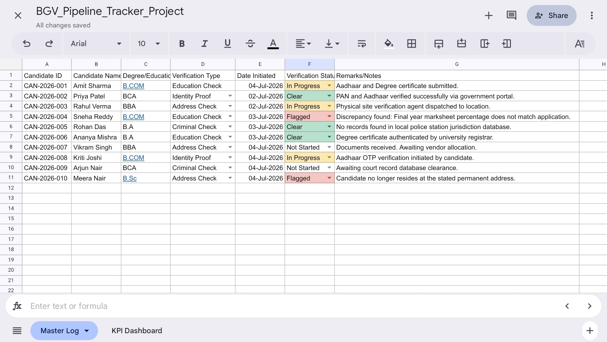
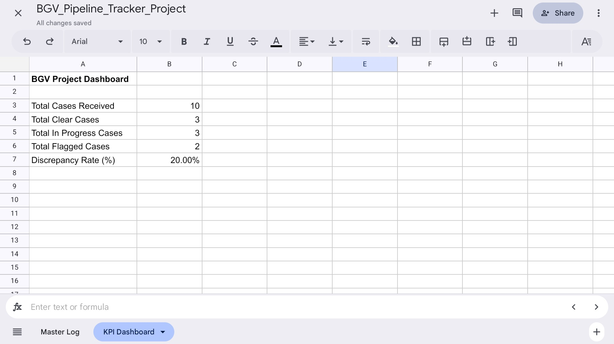

# Employee Background Verification (BGV) Pipeline Tracker

## Project Overview
This project simulates an entry-level HR Operations workflow utilized by professional service firms (such as KPMG India) to manage candidate onboarding risks. Built entirely using cloud-based spreadsheet modeling, this tool automates data integrity tracking and provides real-time operational insights for high-volume corporate vetting environments.

🚀 **[Click Here to View the Live Google Sheets Project](https://docs.google.com/spreadsheets/d/1ww79Ay2_X6DIUnniLFN9zwpbAqGmhuNKz9Y40NPKUzY/edit?usp=drivesdk)**

---

## Key Features & Functionalities

### 1. Automated Master Log
*   **Data Integrity:** Implemented structured Data Validation drop-down menus for tracking Verification Types (Education, Criminal, Address) and Real-time Statuses to eliminate manual data entry faults.
*   **Visual Risk Triggers:** Configured conditional formatting rules to instantly color-code cases based on workflow states (`Clear` = Green, `In Progress` = Yellow, `Flagged` = Red).

### 2. Live KPI Dashboard
*   **Operational Metrics:** Built a dynamic summary dashboard utilizing advanced logical formulas (`COUNTIF`, `COUNTA`) to instantly calculate operational parameters: Total Volume Received, Open Backlog Processing Cases, and Total Escalated/Flagged Cases.
*   **Discrepancy Analytics:** Programmed automated rate calculations to monitor operational quality and risk density across candidate batches.

---

## Core Skills Demonstrated
*   Spreadsheet Automation & Advanced Formulas (`COUNTIF`, `COUNTA`, Logical Divisions)
*   Data Validation & Data Integrity Management
*   Operational Dashboard Design & Data Visualization

*   ---

## Project Screenshots

### Master Log View

### KPI Dashboard View

